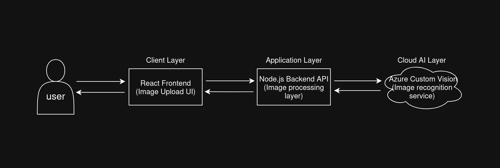
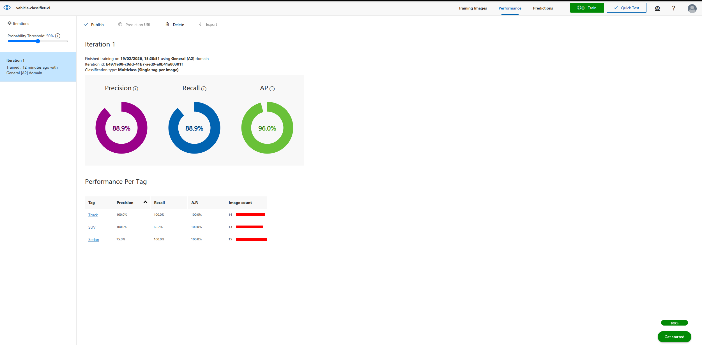
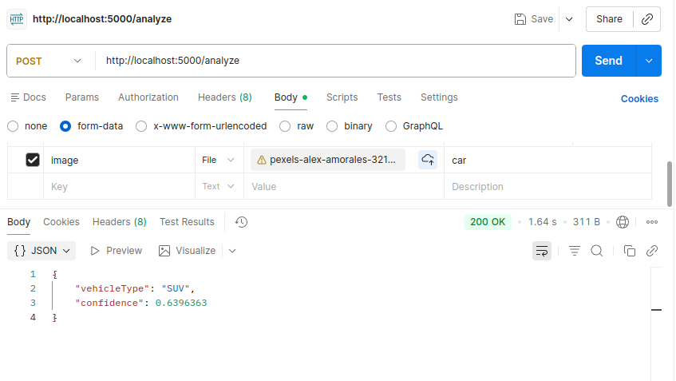
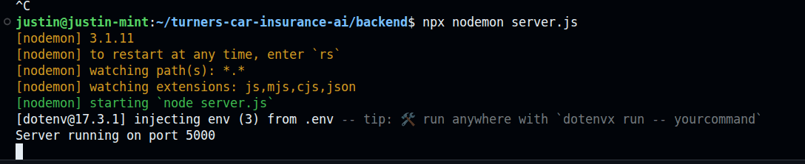

# Turners Car Insurance AI Prototype

This project is a cloud-based prototype that uses Azure AI to recognize vehicle types from uploaded images. The goal is to explore how AI can help support Turners Car Insurance by automatically identifying vehicles as part of the insurance process.

This repository will include project documentation, stakeholder analysis, and the AI prototype.

## Architecture

This system follows a layered cloud architecture:


Client → Node.js Backend → Azure Custom Vision → Prediction Result

Architecture diagram:



---

## How It Works

1. User uploads a vehicle image
2. Backend receives image via `/analyze` endpoint
3. Backend sends image to Azure Custom Vision Prediction API
4. Azure AI model analyzes the image
5. Azure returns classification probabilities
6. Backend returns the highest confidence vehicle type

Example response:

```json
{
  "vehicleType": "SUV",
  "confidence": 0.92
}
```

---

## Custom Vision Model

The Custom Vision model was trained using three vehicle categories:

- SUV
- Sedan
- Truck

Training included around 15 images per category.

Model performance:



Prediction example:



---

## Backend API

Endpoint:

```
POST /analyze
```

Description:

Accepts an image file and returns vehicle classification using Azure Custom Vision.

Backend running:



---

## Technologies Used

Backend:
- Node.js
- Express.js
- Axios
- Multer

Cloud:
- Microsoft Azure Custom Vision
- Azure Cognitive Services

Tools:
- GitHub
- Postman
- Jira

---

## Project Structure

```
backend/
screenshots/
architecture-diagram.png
README.md
stakeholders.md
project-context.md
```

---

## Purpose

This prototype demonstrates how cloud‑based AI can automatically classify vehicle types to support insurance processing, reducing manual work and improving efficiency.
